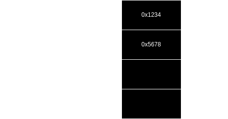
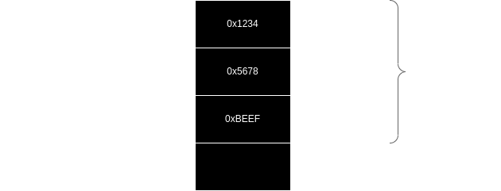
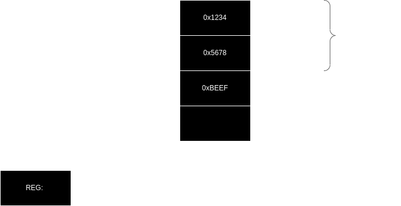
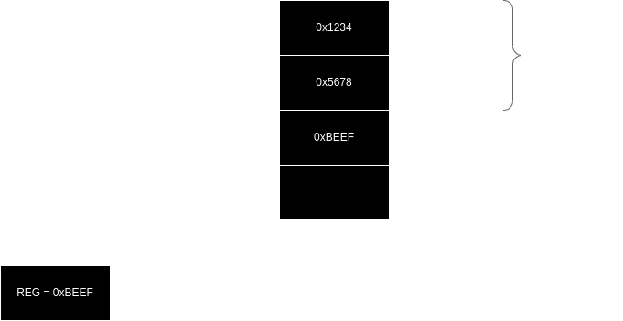
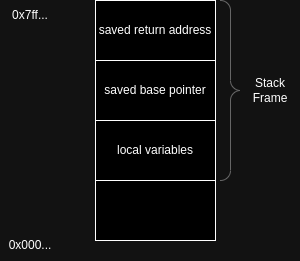
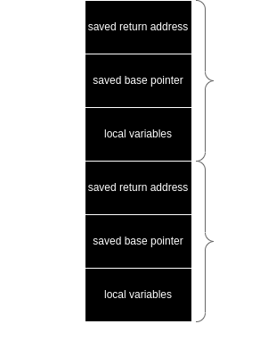

# Binary Exploitation

In this module, students will learn about binary exploitation techniques and vulnerabilities in software that can be exploited to take control of a system. The module will cover various techniques for identifying, exploiting, and defending against common vulnerabilities in binary programs.

## Learning Objectives

- Understand the basic principles of binary exploitation
- Identify common vulnerabilities in binary programs
- Use tools such as gdb and pwntools to analyze and exploit binary vulnerabilities
- Implement basic defenses against common binary exploits

## Topics Covered

1. Introduction to Binary Exploitation
2. Basic Stack Overflows
3. Return Oriented Programming (ROP)
4. Format String Vulnerabilities
5. Heap Exploitation
6. Defending Against Binary Exploits

By the end of this module, students should have a basic understanding of binary exploitation techniques and the ability to identify and exploit common vulnerabilities in binary programs. They should also be able to implement basic defenses


### Introduction to Binary Exploitation
Many programs are written in memory unsafe languages like C/C++.
For instance, operating systems, browsers, the runtime of languages like Java.

**Binary exploitation** is the art of finding vulnerabilities in programs and leveraging them to gain control over the entire program.
Conversely, **memory safety** tries to avoid these types vulnerabilities.

Typical examples of memory safety violations that can be exploited in binaries are:

- Overflows and overreads on stack and heap
- Invalid pointers
- Race conditions
- Invalid frees/Use after free
- Null pointer dereferences
- Uninitialized memory accesses


A program is considered to be free of memory safety violations if there are no exploitable vulnerabilities given.
Programming languages like *Rust* try to guarantee that there are no memory safety violations[2].  


A **memory safety violation** can be further classified into the two main types **spatial** and **temporal** violations.
A spatial violation accesses memory that is considered to be out of bounds.
For instance, reading more bytes of a memory buffer than the actual defined size.

Examples for spatial memory safety violations are:
- Buffer overflows
- Out-of-bounds reads
- Null pointer dereferences

Temporal memory safety violations access memory that is considered to be invalid.

Typical examples are:
- Use after free 
- Double free
- Use of uninitialized memory

A list of vulnerabilities by type can be found [here](http://www.cvedetails.com/vulnerabilities-by-types.php).


### Stack
The stack is one of the most fundamental data structures used in computer science and programming.
It follows a Last-In, First-Out (LIFO) policy, meaning the most recently added item is the first one to be removed. 
This property makes the stack particularly useful for various algorithms and system processes like function call management, undo operations, parsing expressions, and more.


The **stack pointer** is a special-purpose register that keeps track of the top of the stack.  
When calling a function, the return address, i.e. the address to jump back after executing the function, is pushed onto the stack. 
The stack grows and shrinks as functions are called and return, and the stack pointer always points to the top of the current stack.

When you push a value onto the stack, the stack pointer is decremented to allocate space for the value (assuming the stack grows downward, which is common). 
When you pop a value off the stack, the stack pointer is incremented to free up that space. 
Note that the data is not overwritten and just the pointer incremented.

The **base pointer**, also known as the frame pointer, is used to point to the beginning of a stack frame. 
Relative to the base pointer data can be easily indexed.

When a function is called, one of the first things it often does is save the previous function's base pointer by pushing it onto the stack. 
The base pointer is then set to the current value of the stack pointer. 
When returning from the function, the old base pointer is restored from the stack, effectively cleaning up its own stack frame.

##### Push to Stack




#### Pop from Stack




### Calling Conventions
On x86 (32-bit) there are various ways to call a function call.

- cdecl (C Declaration)

Caller responsibilities: Clean up the stack after the function call.
Argument Passing: Arguments are pushed onto the stack from right to left.
Return Value: Typically returned in the EAX register.
Commonly Used In: C and C++ programming on Linux and other Unix-like OSes.

- stdcall

Callee responsibilities: Clean up the stack before returning.
Argument Passing: Arguments are pushed onto the stack from right to left.
Return Value: Returned in the EAX register.
Commonly Used In: Windows API.

- fastcall

Callee responsibilities: Clean up the stack, if needed.
Argument Passing: The first two or three arguments are often passed in registers (ECX, EDX, and sometimes EAX), and the rest are pushed onto the stack.
Return Value: Returned in the EAX register.
Commonly Used In: Special cases where speed is a concern.

- thiscall

Callee responsibilities: Clean up the stack.
Argument Passing: The this pointer is usually passed in a register like ECX, and other arguments are pushed onto the stack.
Return Value: Returned in the EAX register.
Commonly Used In: C++ member function calls on Windows.
General Rules:
Arguments: Typically, arguments are passed via the stack, although some conventions make use of registers for this purpose.

Stack Cleanup: Either the caller (e.g., cdecl) or the callee (e.g., stdcall) is responsible for cleaning up the stack after a function call.

Return Value: The return value is generally stored in the EAX register.

Base Pointer: The EBP register is commonly used to reference parameters and local variables within the function. The previous EBP value is saved on the stack to allow for nested function calls.


#### Calling a function Stack






Consider the following function:
```C
int main() {
    int a = 1, b = 2, c = 3;
    int result = foo(a, b, c); // Function Call
    printf("The sum is: %d\n", result);
    return 0;
}

// Function Definition
int foo(int a, int b, int c) {
    return a + b + c;
}
```

The call to the function can look as follows.
```x
; Caller-side code
push c
push b
push a
call foo
```


### Basic Stack Overflows
The stack is one of the most important data structures used in modern computer systems.
The stack has two main operations called *push* and *pop*.
A push operation adds an element to the stack, while the pop takes an element from the stack.
Important registers on x86 are the stack pointer (`esp`/`rsp`), pointing to the current element in the stack and the base pointer, pointing to the start address of the stack. 
A *stack frame* defines the full set of elements in the stack , i.e. all elements starting from the base pointer (start address) to the stack pointer.


A *buffer* is a consecutive chunk of memory storing the same type of memory with a fixed boundary.
A buffer is defined by a start address and size. 
The snippet below shows a typical memory allocation on the stack.
Here, the string "Some data" is copied to buffer.
However, this copy operation does not check the length of the buffer. 

```C
char buffer[10];
strcpy(buffer,"Some data");
```

If the string exceeds the length of the buffer data will be overwritten that is out-of-bounds.
Check out the example in the examples folder, run the `make` command and start the binary `./simple_buffer`.

You can see that the 
```
  strcpy(buffer,"Some dataOOOOOVERFLOW\n");
```

leads to a crash of the binary. 

Let's take another example:
```C
#include <stdio.h>
#include <string.h>

void parseInput(char* input) {
    char message[16];
    strcpy(message,input);
    printf("Hello the message is: %s\n",message);
}

int main(int argc, char* argv[]) {
    if(argc > 1) parseInput(argv[1]);
    return 0;
}
```

Now make and run the `./return_address` program with various different inputs.

If you exceed the program for instance with too many letters you can again crash the program.
Now in addition, start the program with GDB and check out where the program counter (RIP) points to. 

Run `gdb --args ./return_address AAAAAAAAAAAAAAAAAAAAAAAAAAAAAAAA`

This should overwrite the return address of the program with `0x4141414141414141`.

You can get the same message on a Debian based system by using the `sudo dmesg` command and look for segmentation faults.

Now that you understood how the stack and calling functions works on the low-level side you have a strong attack primitive by overwriting return addresses.
Note that not only return addresses lie on the stack.
There could also be *function pointers*, *local variables* manipulating the control flow that  


### Resources
[1] https://people.eecs.berkeley.edu/~dawnsong/papers/Oakland13-SoK-CR.pdf
[2] https://www.embedded.com/memory-safety-in-rust/